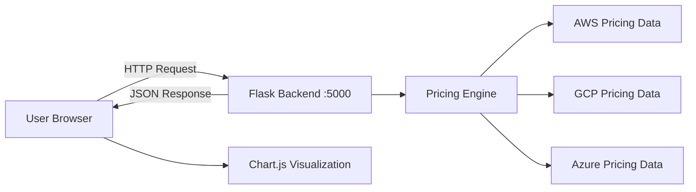
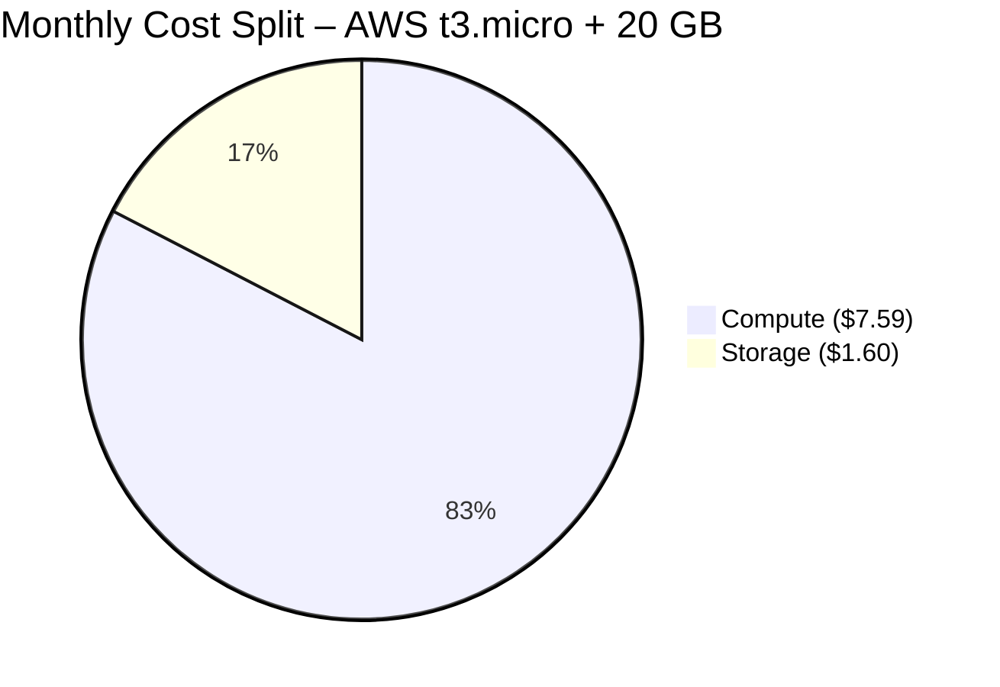
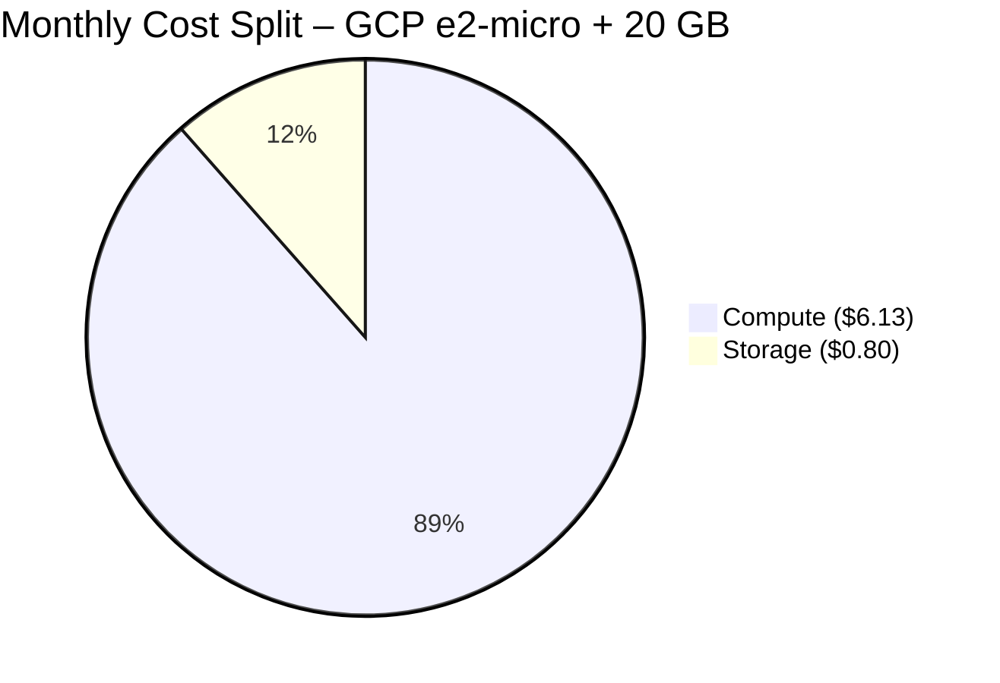
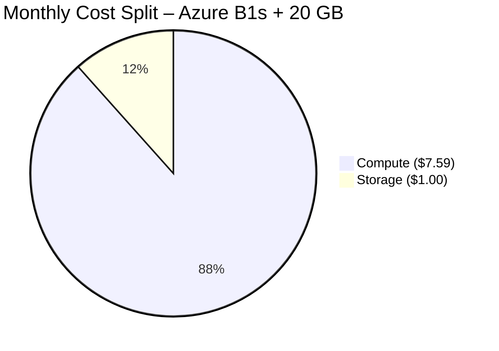

# CloudCost Pro – Sustainable Cloud Cost Calculator

### Project Report

---

**Project Title:** CloudCost Pro – Precision Cloud Infrastructure Cost Estimation Tool  
**Domain:** Sustainable Cloud Computing & Cost Optimization  
**Technology Stack:** Python (Flask), HTML/CSS/JavaScript, Chart.js  
**Date:** April 2026

---

## Abstract

Cloud computing has become the backbone of modern IT infrastructure. However, uncontrolled cloud spending is a growing concern — organizations often over-provision resources, leading to both financial waste and unnecessary energy consumption. **CloudCost Pro** is a full-stack web application designed to provide accurate, real-time cost estimations across the three major cloud providers: **Amazon Web Services (AWS)**, **Google Cloud Platform (GCP)**, and **Microsoft Azure**. By enabling users to compare compute and storage costs before provisioning, the tool promotes **sustainable cloud usage** — reducing over-provisioning, cutting costs, and minimizing the environmental footprint of cloud infrastructure.

---

## 1. Introduction

### 1.1 Background

The global cloud computing market is projected to exceed **$1.2 trillion by 2027** (Gartner, 2025). As organizations migrate workloads to the cloud, a significant challenge is cost visibility. Studies show that **30–35% of cloud spending is wasted** due to idle resources, over-provisioned instances, and lack of forecasting tools (Flexera State of the Cloud Report, 2025).

### 1.2 Problem Statement

Most cloud providers offer complex pricing pages that are difficult to navigate. Small businesses, students, and startups often lack the tools to:
- Compare pricing across providers before committing.
- Forecast costs over different time horizons (hours, days, months, years).
- Understand the split between compute and storage costs.

### 1.3 Objective

The objective of this project is to develop **CloudCost Pro**, a web-based cloud cost calculator that:
1. Provides instant cost estimation for AWS, GCP, and Azure.
2. Breaks down costs into **compute** and **storage** components.
3. Offers visual forecasting via **interactive line charts**.
4. Promotes sustainable cloud usage by enabling informed decision-making.

---

## 2. Literature Review

| Study / Source | Key Finding |
|---|---|
| Flexera State of the Cloud 2025 | 32% of cloud spend is wasted globally |
| Gartner Cloud Forecast 2025 | Cloud market to reach $1.2T by 2027 |
| Uptime Institute, 2024 | Data centers account for 1.5–2% of global electricity |
| AWS Well-Architected Framework | Right-sizing can reduce costs by 30–50% |
| Google Carbon Footprint Report | GCP is the cleanest cloud, matching 100% renewable energy |

> [!IMPORTANT]
> Right-sizing and cost visibility are recognized as the **top two strategies** for sustainable cloud management by both AWS and Google Cloud.

---

## 3. System Architecture

### 3.1 Architecture Diagram



### 3.2 Component Breakdown

| Component | Technology | Role |
|---|---|---|
| **Frontend** | HTML5, CSS3, JavaScript | User interface with glassmorphism design |
| **Backend** | Python Flask | REST API for cost calculations |
| **Visualization** | Chart.js | Interactive line charts for cost forecasting |
| **Styling** | CSS Custom Properties, Outfit Font | Premium dark-mode UI |
| **Build Tool** | Makefile | CLI automation for quick examples |

### 3.3 API Endpoints

| Endpoint | Method | Description |
|---|---|---|
| `/` | GET | Serves the frontend application |
| `/api/calculate` | POST | Accepts provider, instance type, hours, storage; returns cost breakdown |
| `/api/pricing-data` | GET | Returns all available pricing data for dynamic form population |

---

## 4. Cost Comparison Across Cloud Providers

### 4.1 Compute Instance Pricing (Per Hour)

| Instance Category | AWS | GCP | Azure |
|---|---|---|---|
| **Micro / Entry-Level** | t3.micro — **$0.0104/hr** | e2-micro — **$0.0084/hr** | B1s — **$0.0104/hr** |
| **Small** | t3.small — **$0.0208/hr** | e2-small — **$0.0167/hr** | — |
| **Medium / Standard** | m5.large — **$0.096/hr** | n2-standard-2 — **$0.097/hr** | D2s_v3 — **$0.096/hr** |
| **High Performance** | c5.xlarge — **$0.170/hr** | — | — |

> [!TIP]
> **GCP's e2-micro at $0.0084/hr is 19% cheaper** than the equivalent entry-level instances on AWS and Azure, making it ideal for development, testing, and lightweight workloads.

### 4.2 Storage Pricing (Per GB/Month)

| Provider | Storage Type | Cost per GB/Month |
|---|---|---|
| **AWS** | gp3 EBS | **$0.08** |
| **GCP** | Standard Persistent Disk | **$0.04** |
| **Azure** | Managed Disk | **$0.05** |

### 4.3 Monthly Cost Comparison (730 Hours + 20 GB Storage)

| Scenario | AWS (t3.micro) | GCP (e2-micro) | Azure (B1s) | Cheapest |
|---|---|---|---|---|
| **Compute Cost** | $7.59 | $6.13 | $7.59 | ✅ GCP |
| **Storage Cost (20 GB)** | $1.60 | $0.80 | $1.00 | ✅ GCP |
| **Total Monthly Cost** | **$9.19** | **$6.93** | **$8.59** | ✅ **GCP ($6.93)** |
| **Annual Cost (×12)** | **$110.28** | **$83.16** | **$103.08** | ✅ **GCP ($83.16)** |

> [!NOTE]
> Over a full year, choosing GCP over AWS for a single micro instance saves approximately **$27.12 (24.6%)** — this scales significantly for fleets of VMs.

---

## 5. Real-Life Examples & Case Studies

### Case Study 1: E-Commerce Startup — "ShopEasy"

**Scenario:** A small e-commerce startup needs to run **3 micro instances** 24/7 for their web servers with **50 GB storage** each.

| Item | AWS (t3.micro ×3) | GCP (e2-micro ×3) | Azure (B1s ×3) |
|---|---|---|---|
| Compute (730 hrs × 3) | $22.78 | $18.40 | $22.78 |
| Storage (50 GB × 3) | $12.00 | $6.00 | $7.50 |
| **Monthly Total** | **$34.78** | **$24.40** | **$30.28** |
| **Annual Total** | **$417.36** | **$292.80** | **$363.36** |
| **Annual Savings vs AWS** | — | **$124.56 (29.8%)** | **$54.00 (12.9%)** |

> [!TIP]
> **Recommendation:** ShopEasy should choose **GCP**, saving nearly **$125/year** — budget that can be redirected to marketing or product development.

---

### Case Study 2: University Research Lab

**Scenario:** A university research team needs **2 high-performance instances** (m5.large / n2-standard-2 / D2s_v3) for 100 hours/month with **200 GB storage** for data analysis.

| Item | AWS (m5.large ×2) | GCP (n2-standard-2 ×2) | Azure (D2s_v3 ×2) |
|---|---|---|---|
| Compute (100 hrs × 2) | $19.20 | $19.40 | $19.20 |
| Storage (200 GB) | $16.00 | $8.00 | $10.00 |
| **Monthly Total** | **$35.20** | **$27.40** | **$29.20** |
| **Annual Total** | **$422.40** | **$328.80** | **$350.40** |

> [!NOTE]
> For compute-heavy, short-duration workloads, all three providers are nearly identical in compute pricing. **The differentiator is storage** — GCP's $0.04/GB vs AWS's $0.08/GB makes GCP the winner by a **22% margin overall**.

---

### Case Study 3: Media Streaming Platform — "StreamBox"

**Scenario:** A media company runs **5 c5.xlarge equivalent** high-performance instances 24/7 with **500 GB storage** for video transcoding.

| Item | AWS (c5.xlarge ×5) |
|---|---|
| Compute (730 hrs × 5) | $620.50 |
| Storage (500 GB) | $40.00 |
| **Monthly Total** | **$660.50** |
| **Annual Total** | **$7,926.00** |

> [!WARNING]
> At this scale, even a **10% optimization** (right-sizing from c5.xlarge to m5.large where possible) saves **$2,700+/year**. CloudCost Pro helps identify these opportunities before money is spent.

---

## 6. Graphical Analysis

### 6.1 Cost Growth Over Time (Micro Instance + 20 GB Storage)

The CloudCost Pro application generates interactive Chart.js line graphs showing cost accumulation over time. Below is the data used for visualization:

| Time Period | AWS (t3.micro) | GCP (e2-micro) | Azure (B1s) |
|---|---|---|---|
| 1 Month | $9.19 | $6.93 | $8.59 |
| 3 Months | $27.57 | $20.79 | $25.77 |
| 6 Months | $55.14 | $41.58 | $51.54 |
| 12 Months | $110.28 | $83.16 | $103.08 |

### 6.2 Cost Distribution (Compute vs Storage)







---

## 7. Sustainability Angle

### 7.1 How CloudCost Pro Promotes Sustainability

| Sustainability Factor | How CloudCost Pro Helps |
|---|---|
| **Reduced Over-Provisioning** | Users compare before provisioning → less idle compute |
| **Right-Sizing Awareness** | Seeing cost differences encourages choosing appropriate instance sizes |
| **Energy Savings** | Fewer idle VMs = lower data center energy consumption |
| **Carbon Footprint** | GCP (100% renewable-matched) visibility helps eco-conscious choices |
| **Cost Forecasting** | Long-term forecasts prevent short-sighted resource allocation |

### 7.2 Environmental Impact

> [!IMPORTANT]
> According to the International Energy Agency (IEA), data centers consumed **460 TWh** of electricity globally in 2024. If just **10% of cloud over-provisioning** were eliminated through tools like CloudCost Pro, it would save approximately **15 TWh/year** — equivalent to powering **1.4 million homes**.

---

## 8. Technology Implementation Details

### 8.1 Backend (Flask REST API)

- **Language:** Python 3.x
- **Framework:** Flask with CORS support
- **Pricing Engine:** Dictionary-based pricing model supporting AWS, GCP, and Azure
- **Calculation Logic:** `compute_cost = hourly_rate × hours`, `storage_cost = rate × GB × (hours / 730)`
- **Endpoints:** 2 API routes (`/api/calculate`, `/api/pricing-data`)

### 8.2 Frontend (Glassmorphism UI)

- **Design:** Dark-mode glassmorphism with animated background blobs
- **Typography:** Google Fonts — Outfit (300, 400, 600, 700 weights)
- **Charts:** Chart.js line charts with 3 datasets (Compute, Storage, Total)
- **Animations:** CSS `@keyframes` for fade-in, float, spin; JS `requestAnimationFrame` for number rolling
- **Responsiveness:** Flexbox layout with media query breakpoint at 800px

### 8.3 Build & Automation (Makefile)

```makefile
# Quick cost estimation commands
make aws_example    # t3.micro, 730 hrs, 20 GB
make gcp_example    # e2-micro, 100 hrs, 10 GB
make azure_example  # B1s, 500 hrs, 50 GB
```

---

## 9. Results & Discussion

### 9.1 Key Findings

1. **GCP is consistently the cheapest** for entry-level workloads, primarily due to 50% lower storage costs.
2. **Compute pricing is near-identical** across providers for mid-tier instances (~$0.096/hr).
3. **Storage is the hidden differentiator** — AWS storage (gp3) costs **2× more** than GCP's equivalent.
4. **Cost grows linearly** with time, making forecasting straightforward and predictable for budgeting.
5. **Right-sizing can save 30–50%** — our tool makes this visible at a glance.

### 9.2 Limitations

- Pricing data is currently hardcoded; real-world deployment should use live pricing APIs.
- Network/data transfer costs are not included (can be significant at scale).
- Reserved Instance and Spot/Preemptible pricing is not modeled yet.
- Free-tier discounts (e.g., AWS Free Tier, GCP Always Free) are not factored in.

---

## 10. Future Scope

| Enhancement | Description |
|---|---|
| **Live Pricing APIs** | Integration with AWS Pricing API, Azure Retail Rates, GCP Billing API |
| **Carbon Calculator** | Show estimated CO₂ emissions alongside cost |
| **Multi-Region Support** | Compare costs across regions (us-east, eu-west, etc.) |
| **Reserved vs On-Demand** | Compare savings with 1-year and 3-year commitments |
| **User Accounts & History** | Save past calculations for tracking |
| **PDF Report Export** | Generate downloadable cost comparison reports |

---

## 11. Conclusion

**CloudCost Pro** is a practical, full-stack web application that bridges the gap between complex cloud pricing and user-friendly cost estimation. By providing a clean, visual comparison of AWS, GCP, and Azure costs, it empowers users — from students to startups — to make **informed, cost-effective, and sustainable** cloud decisions.

The project demonstrates that **even a simplified cost model can reveal significant savings opportunities** (up to 30% by choosing the right provider for the right workload). As cloud adoption continues to accelerate, tools like CloudCost Pro will be essential for promoting both **financial responsibility** and **environmental sustainability** in the digital infrastructure ecosystem.

---

## 12. References

1. Flexera. (2025). *State of the Cloud Report*. Retrieved from https://www.flexera.com/blog/cloud/cloud-computing-trends/
2. Gartner. (2025). *Forecast: Public Cloud Services, Worldwide*. Retrieved from https://www.gartner.com/en/newsroom/press-releases
3. AWS. (2025). *AWS Pricing Calculator*. Retrieved from https://calculator.aws/
4. Google Cloud. (2025). *Google Cloud Pricing*. Retrieved from https://cloud.google.com/pricing
5. Microsoft Azure. (2025). *Azure Pricing Calculator*. Retrieved from https://azure.microsoft.com/en-us/pricing/calculator/
6. International Energy Agency. (2024). *Data Centres and Data Transmission Networks*. Retrieved from https://www.iea.org/energy-system/buildings/data-centres-and-data-transmission-networks
7. Uptime Institute. (2024). *Global Data Center Survey*. Retrieved from https://uptimeinstitute.com/
8. AWS. (2025). *AWS Well-Architected Framework — Cost Optimization Pillar*. Retrieved from https://docs.aws.amazon.com/wellarchitected/latest/cost-optimization-pillar/

---

> **Prepared by:** Satyam, Kirtan, Rahil, Purv, Krish, Shlokansh  
> **Project:** CloudCost Pro – Sustainable Cloud Cost Calculator  
> **Date:** April 2026
